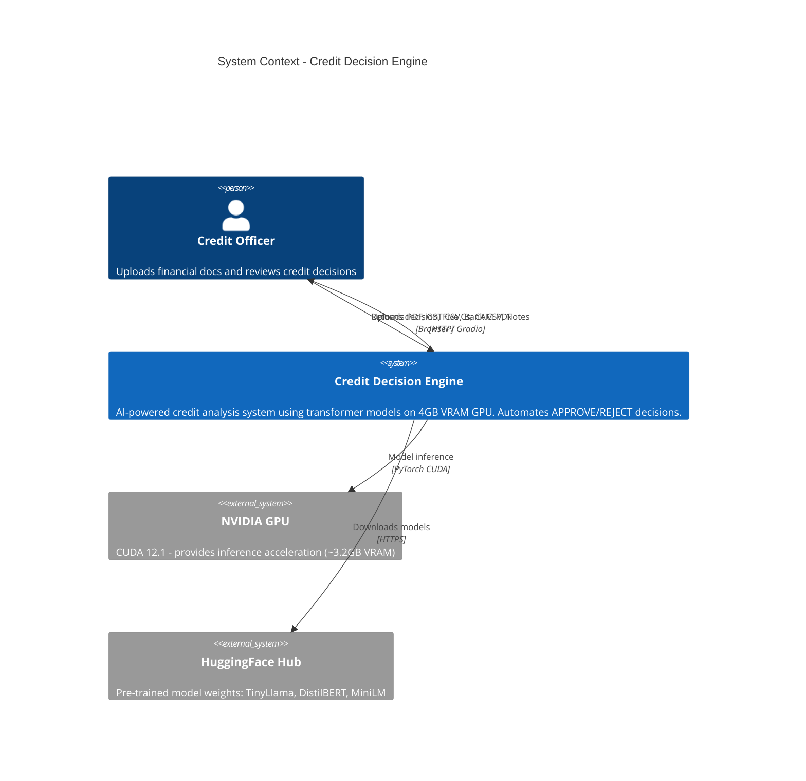
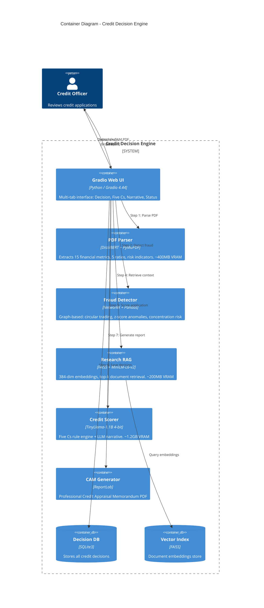
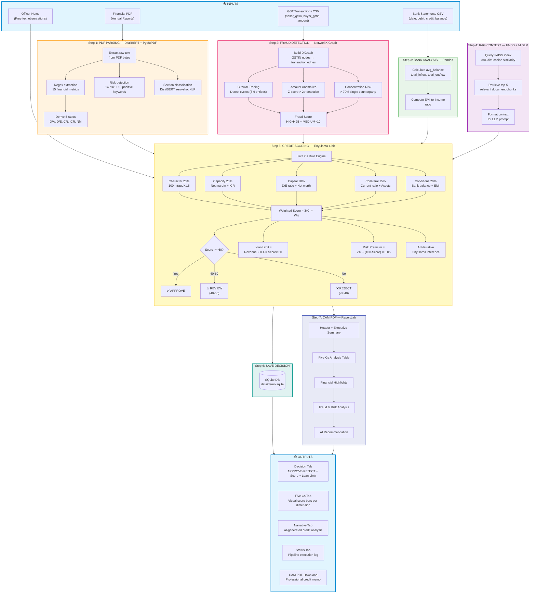
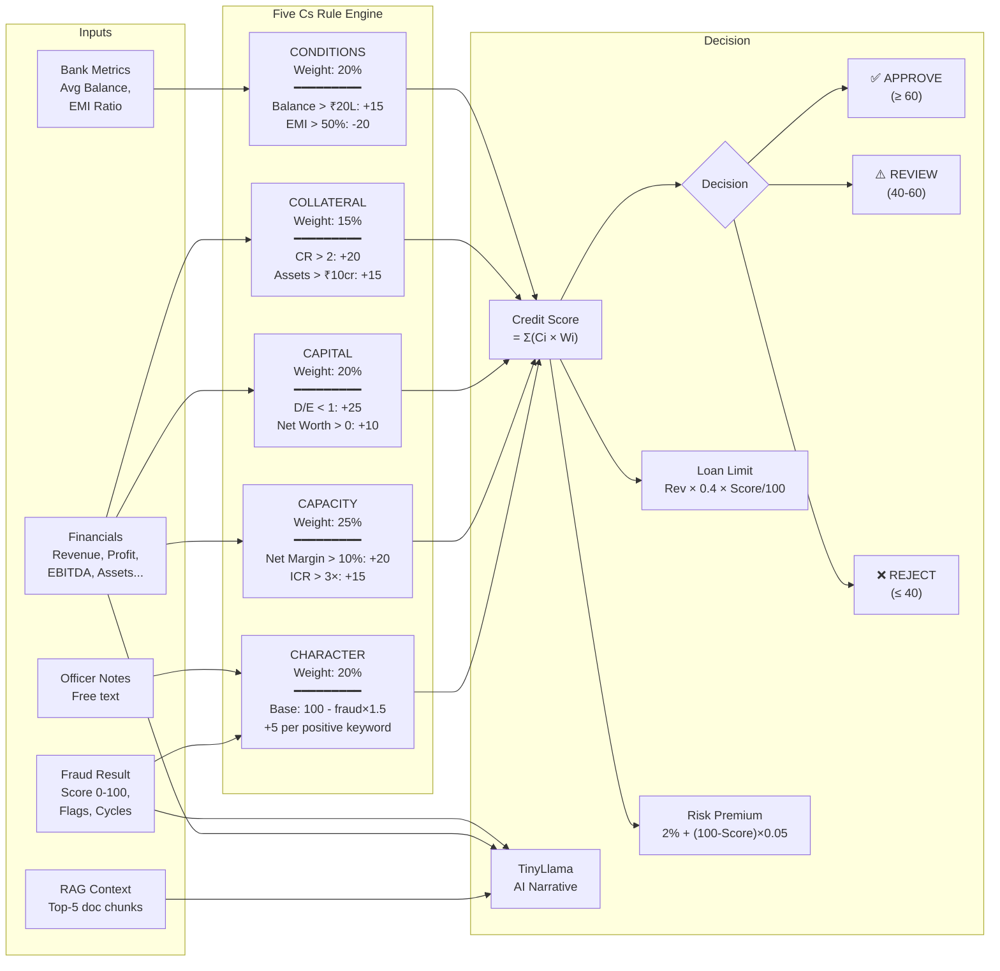
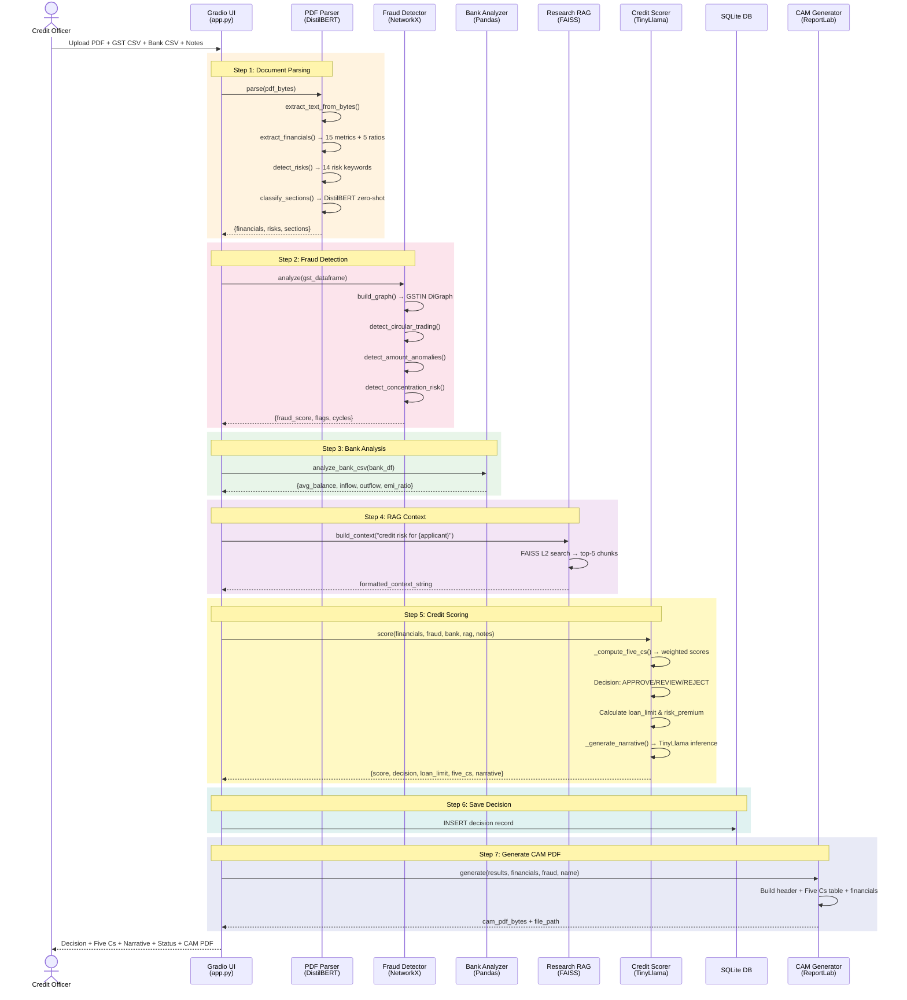
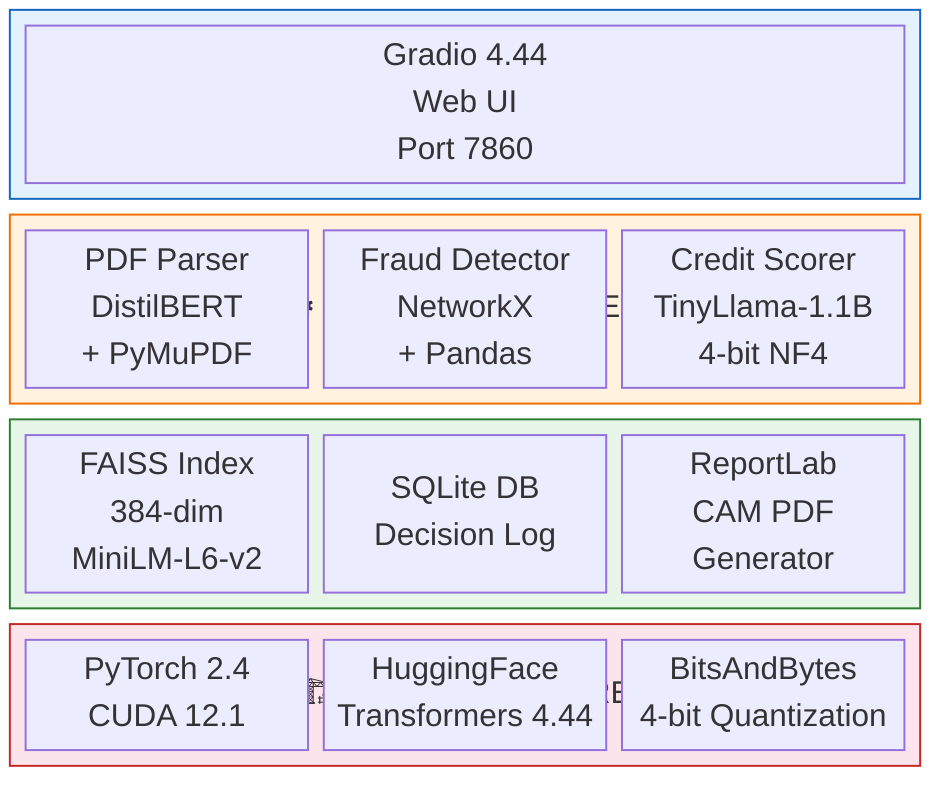

# Credit Decision Engine - C4 Diagrams (Mermaid)

Use these in any Mermaid-compatible tool (mermaid.live, GitHub, Notion, etc.)

---

## 1. System Context Diagram

---

## 2. Container Diagram

---

## 3. Full Pipeline Flow Diagram

---

## 4. Component Diagram - Scorer (Five Cs Breakdown)

---

## 5. Sequence Diagram

---

## 6. Technology Stack Diagram

